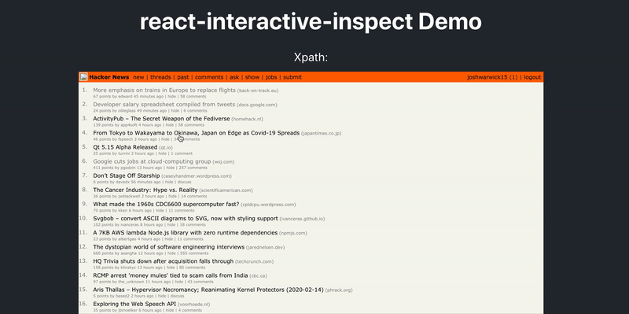

# react-interactive-inspect

> A react component to select part of a webpage, given the raw html and css as strings

[](https://www.npmjs.com/package/react-interactive-inspect) [](https://standardjs.com)



## Demo

https://react-interactive-inspect.netlify.com

## Install

```bash
npm install --save react-interactive-inspect
```

```bash
yarn add react-interactive-inspect
```

## Usage

```tsx
import * as React from "react";

import InteractiveXPathSelector from "react-interactive-inspect";

const htmlData = "<html><ul><li>1</li><li>2</li><li>3</li></ul></html>";
const cssData = "ul { paddingBottom: 10px }";

const Example: React.FC = () => (
  <InteractiveXPathSelector
    html={htmlData}
    css={cssData}
    onSelect={path => console.log(path)}
  />
);
```

## License

MIT © [jaw9c](https://github.com/jaw9c)
